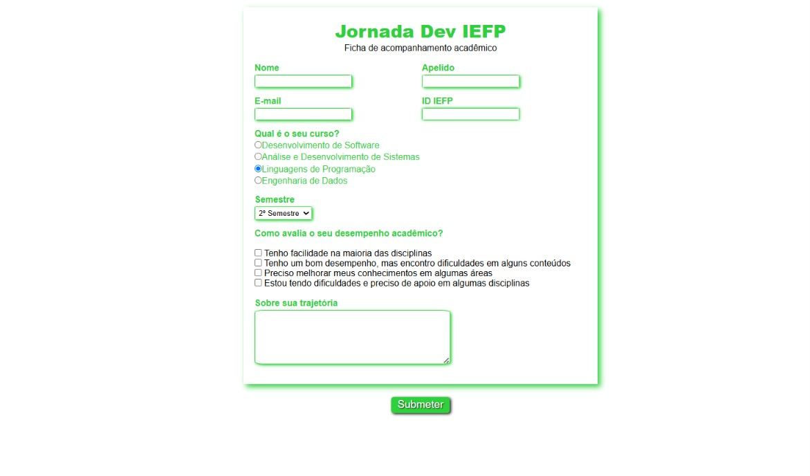
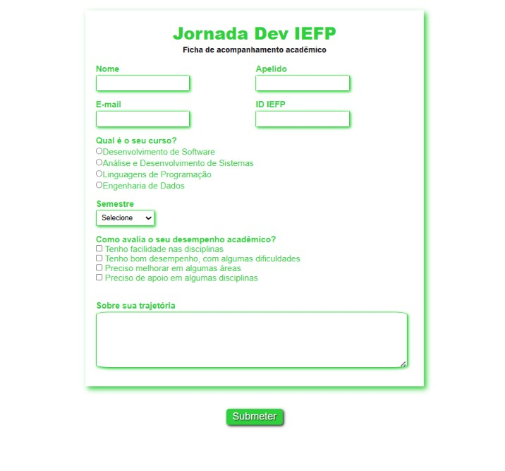

# Projeto Formulário de Cadastro de Alunos 

Estou criando esse projeto para praticar HTML, CSS, JavaScript e Git/GitHub. talvez no futuro eu o transforme em um sistema completo de ou faça modificações para treinar a evolução nas seguintes linguagens. No momento este projeto tem a única finalidade de compor meu portifólio.

## Sobre o Formulário

**Nome:** Ficha de Acompanhamento Acadêmico

**Descrição:** Formulário destinado ao cadastro e acompanhamento da trajetória acadêmica dos alunos de Desenvolvimento de Software e outras tecnologias, reunindo informações pessoais, disciplinas cursadas, conhecimentos técnicos, tecnologias estudadas e objetivos profissionais.

**Finalidade:** Auxiliar no acompanhamento da evolução dos estudantes, permitindo identificar competências desenvolvidas, áreas de interesse e necessidades de aprendizado ao longo do curso.

**Repositório:** Sistema web para cadastro e acompanhamento acadêmico de estudantes de Desenvolvimento de Software.

## Sintaxe do formulário de cadastro de alunos:

*Identificação do aluno → quem é a pessoa*
*Curso e semestre → contexto acadêmico*
*Avaliação das disciplinas → percepção de desempenho*
*Mensagem aberta → espaço para reflexão e comentários*

## Imagens do processo

